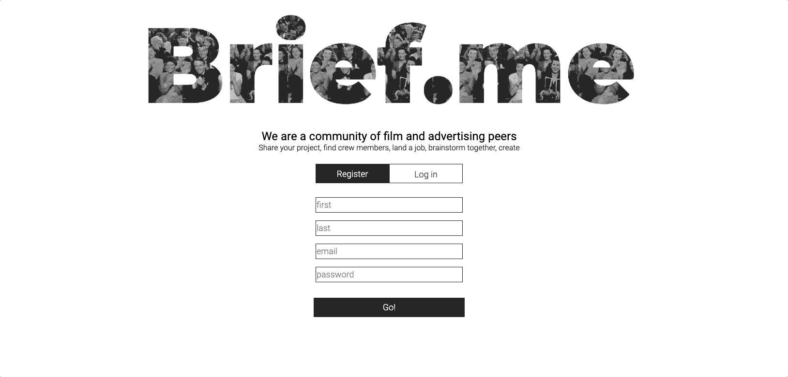

# Social network built with React.js

## Description 

Brief.me - is a Facebook-inspired social network for film and advertising professionals. It's a  single-page application, built with React.js/Redux/Hooks.

## Stack: 

- React.js including Hooks and Redux.
- Axios.
- AWS S3.
- Socket.IO.
- SQL and Postgres.
- Node.js and Express.
- Multer and FormData.
- Cookie Session and csurf against CSRF attacks.
- CSS.

## Features: 

- create and edit a personal profile, upload a profile image.
- send, receive and accept friend requests, visit other users' profiles, search for friends, see recently joined users.
- have a real-time conversation in a chat-room with all users, have a private one-on-one conversation in a messenger.

## Preview: 

- login and registration

  

- see recently joined users, search for friends, check other user's profile, add / cancel friend request

  

  

- see friend requests and current friends. Add friends / unfriend without going to their profile.

  

- chat-room and private chat

  